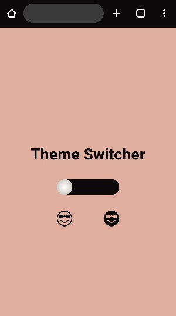
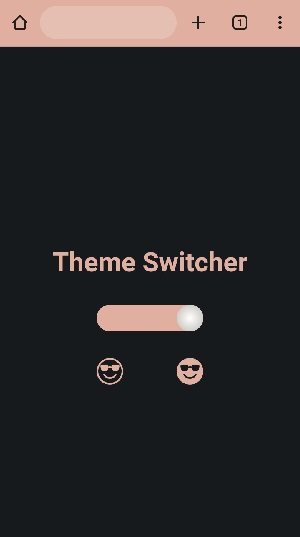

# Theme Switcher #

## Description ##  
This project is a theme switcher made for demo purposes.  
Depending on the user's needs, the theme may be light or dark with the use of a switch.

## Installation and setup ##  
To get started, follow these steps:  
- Make sure you have `Node.js` and `npm` (or `yarn`) installed.
- Clone the project repository
- Navigate to the project directory and install dependencies with `npm install` (or `yarn`).

## Screenshots ##  
&nbsp;&nbsp;&nbsp;&nbsp;&nbsp;&nbsp;

## Project structure ##  
The project follows the standard Angular structure:  
- `src` Contains the application's source code.
- `assets` Houses static assets such as images and icons.
- `app` Contains the main application components.

## Configuration ##  
The `angular.json` file contains project configuration settings.  
It's used to define build options, environments, and more.

## Development ##  
Run `ng serve` for a dev server.  
Navigate to `http://localhost:4200/`.  
The application will automatically reload if you change any of the source files.

## Building ##  
Run `ng build` to build the project. The build artifacts will be stored in the `dist/` directory.

## Functionality Overview ##  
The `app.component.ts` file contains the theme switcher functionality. The `goLight()` and `goDark()` functions toggle the theme and update the meta theme color.

## Styling ##
The app's styles are managed using SCSS. Global styles are defined in `styles.scss`, and component-specific styles are in their respective SCSS files.  
The `app.component.scss` file defines the styles for the theme switcher.  
Keyframe animations `toRight` and `toLeft` are used for smooth transitions.

## Metadata and SEO ##
The `index.html` file contains metadata and Open Graph tags for better SEO and social media sharing.

## Attribution ##
This project was created by **Laëtitia Bodin**.

## Help ##
To get more help on the Angular CLI use `ng help` or go check out the [Angular CLI Overview and Command Reference](https://angular.io/cli) page.